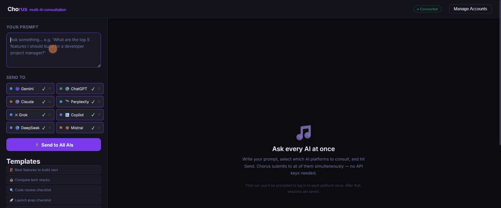

# Chorus

> Send one prompt to every major AI. See where they agree.



**Chorus** is a browser-native multi-AI consultation tool. Write one prompt, send it to ChatGPT, Claude, Gemini, Grok, Perplexity, DeepSeek, Mistral, and Copilot simultaneously — **no API keys required**. Uses your existing logged-in browser sessions and collects all responses into a D3 flowchart with consensus analysis, sentence-level diff, and Markdown export.

---

## Why Chorus?

| Other tools | Chorus |
|---|---|
| Require expensive API keys | Zero API keys — uses your browser sessions |
| Compare 2-3 AIs | 8 AIs simultaneously |
| Raw text side-by-side | D3 tree + Consensus + Diff views |
| No account switching | Per-platform profile manager built in |
| Responses lost on refresh | Full history persisted to disk |
| Closed source / paid | Fully open source |

---

## Supported Platforms

| Platform | URL used |
|---|---|
| 🟢 ChatGPT | chatgpt.com |
| 🟣 Claude | claude.ai/new |
| 🌀 Gemini | gemini.google.com |
| ✕ Grok | x.com/i/grok |
| 🔭 Perplexity | perplexity.ai |
| 🪟 Copilot | copilot.microsoft.com |
| 🔵 DeepSeek | chat.deepseek.com |
| 🔶 Mistral | chat.mistral.ai |

---

## Features

| | |
|---|---|
| ⚡ **Zero API keys** | Playwright drives your real browser — no tokens, no billing |
| 🔀 **Parallel querying** | All AIs receive the prompt simultaneously via `asyncio.gather` |
| 📡 **Live progress** | WebSocket streams each AI's status (queued → typing → done) |
| 🌳 **Tree view** | D3.js radial tree — click any node to read the full response |
| 📋 **Cards view** | Side-by-side response cards with copy button |
| 🎯 **Consensus view** | Keyword agreement analysis — what all AIs agree on vs. split opinions |
| 🔍 **Diff view** | Sentence-level diff — unique insights per AI highlighted in blue |
| 🏷️ **Prompt templates** | 5 built-in templates to get started quickly |
| 📂 **Persistent history** | All sessions saved to disk — reload anytime |
| ↓ **Markdown export** | Download any session as a formatted `.md` file |
| ⚙️ **Account switcher** | Multiple accounts per platform, switch with one click |
| 🧭 **Onboarding wizard** | First-run setup guides you through logging into each platform |
| 🔁 **Error recovery** | Per-platform Retry and Re-login buttons — no full restart needed |

---

## Quick Start

```bash
# 1. Install
pip install chorus-ai

# 2. Install Playwright browser
playwright install chromium

# 3. Run
chorus
```

Open **http://localhost:4747**

> **First run:** Chorus walks you through an onboarding wizard to log in to each platform. Sessions are saved in `chorus/profiles/` and reused automatically.

---

## Adding a New Account (e.g. work Google for Gemini)

1. Click the **⚙** icon next to any platform in the Send panel
2. Click **+ Add account** and enter a name (e.g. `work`)
3. Chorus opens a fresh browser window — log in as your work account
4. Close the login window — the profile is saved
5. Select it from the dropdown next time you send

---

## API

| Method | Endpoint | Description |
|---|---|---|
| `GET` | `/api/platforms` | List platforms + metadata |
| `GET` | `/api/platforms/{p}/profiles` | List saved profiles |
| `POST` | `/api/platforms/{p}/profiles/{name}` | Create profile + open for login |
| `POST` | `/api/query` | Start a query session |
| `POST` | `/api/sessions/{id}/retry/{platform}` | Retry a failed platform |
| `GET` | `/api/sessions/{id}` | Session status + responses |
| `GET` | `/api/sessions/{id}/consensus` | Consensus analysis for a session |
| `GET` | `/api/history` | Saved session history |
| `DELETE` | `/api/history/{id}` | Remove a history item |
| `GET` | `/api/export/{id}` | Download session as Markdown |
| `WS` | `/ws` | Live platform status updates |

---

## Project Structure

```
chorus/
  pyproject.toml
  requirements.txt
  chorus/
    main.py                    # FastAPI app + session orchestration
    browser.py                 # Playwright BrowserManager (persistent profiles)
    websocket_manager.py       # WebSocket broadcast
    selectors.json             # All CSS selectors for every platform (one file)
    platforms/
      base.py                  # BaseAI ABC
      gemini.py
      chatgpt.py
      claude.py
      perplexity.py
      grok.py
      copilot.py
      deepseek.py
      mistral.py
  frontend/
    index.html                 # Full SPA (D3, WebSocket, consensus engine)
  profiles/                    # Browser profiles (gitignored)
```

---

## Adding a New AI Platform

1. Create `chorus/platforms/myai.py` extending `BaseAI`
2. Implement `submit_prompt()` and `wait_for_response()`
3. Add selectors to `chorus/selectors.json`
4. Register in `main.py` `PLATFORMS` and `PLATFORM_META` dicts
5. That's it — the frontend picks it up automatically

---

## Stack

- **Backend:** Python 3.10+, FastAPI, uvicorn
- **Browser automation:** Playwright (Chromium, persistent contexts)
- **Frontend:** Vanilla HTML/CSS/JS, D3.js v7
- **Consensus:** Server-side Jaccard similarity + TF keyword extraction

---

## Known Limitations

| Limitation | Notes |
|---|---|
| **Chromium required** | Playwright only supports Chromium for persistent sessions |
| **Memory usage** | 8 concurrent browser contexts use ~1–2 GB RAM |
| **Selector drift** | Platform UIs change — selectors in `selectors.json` may need updates. PRs for fixes are the fastest path. |
| **Rate limits** | Free-tier accounts can hit rate limits; the per-platform Retry button handles most cases |
| **Follow-up context** | Some platforms expire their conversation tab after inactivity |

---

## Contributing

See [CONTRIBUTING.md](CONTRIBUTING.md). PRs welcome — especially:

- **Selector fixes** when a platform updates its UI (most common need)
- New platform connectors
- UI improvements

## Security

See [SECURITY.md](SECURITY.md). Chorus runs entirely on `127.0.0.1` — no data leaves your machine through Chorus itself.

## Changelog

See [CHANGELOG.md](CHANGELOG.md).

## License

MIT © [Kabi10](https://github.com/Kabi10)
